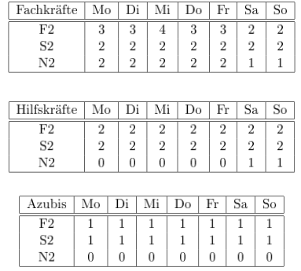

# Constraints
This is an incomplete list of all constraints that we need keep track of in this project.
An ideal constraint would contain a short description, an indicator on where this constrain
comes from (see "Sources of Information"), a mathematical representation, notes about
potential problems and a proposal how to implement such a constraint. For the latest, see
[Documentation OR Tools](https://developers.google.com/optimization/reference/python/sat/python/cp_model#cp_model.CpModel).

_This list is not ideal._

## Sources of Information
1. Problemdefintion (pdf from Moodle)
2. Occupational Health and Safety Law (Arbeitsschutzgesetz) (pdf from Moodle)
3. Guidelines for Shift Work

## Idea for all soft constraints
It is not possible to set multiple maximize or minimize constraints. But we could think about the idea of combining all "soft constraints" to one minimize functions. Give a penalty for each shift that does not match a specific constraint (e.g. rotating fowards). Then we could build a global penalty function that we wanna minimize, where we can also weight the different constraints.

## All Constraints

### Minimal Number of Staff (1)



The above table shows the minimal number of stuff per day and per professional group.
If we have more stuff available:
1. Mo to Fr an additional "Zwischendienst" (T75)
2. "Zwischendienst" at the weekends
3. If there are enough people, Mo to Fr no "Zwischendienst" but one addtional stuff member to the first and second shift

### Free shifts or days (1)
Vacation days, free days on the weekend must remain free.
The day before a vacation day or a free weekend, there is no night shift allowed.
- **Mathematical Representation:**
- **Implementation Idea:** Implementation should be easy. We just iterate through all free days and shifts and set the variables to zero:
```python
model.Add(shift == 0)
```

### Target Working hours (1)
per month a larger deviation than one day shift is not allowed (+/- 7.67 h)
addtionally in the next month this should be cons
!!! Problem here: CP Solver does only work with integers? Maybe scale hours up?
- **Mathematical Representation:**
- **Implementation Idea:** First get the current work time per employee depending on the shifts variables
```python
model.Add(current_work_time_per_employee <= target_minuts + 7.67 * 60)
model.Add(current_work_time_per_employee >= target_minuts - 7.67 * 60)
```

### Minimize Number of Consecutive Night Shifts (3.1)
The number of consecutive night shifts should be as few as possible.
In order to count the consecutive night shifts, we introduce a new variable "consecutive", whcih should be set to 1 only iff
the worker works at the night at day d and d+1, then set the constraint to limit sum of "consecutive"
- **Implementation Idea:** Set "consecutive" to 1 iff night_today && night_tomorrow == 1 
```python
model.AddBoolAnd([night_today, night_after_tomorrow]).OnlyEnforceIf(consecutive)
model.AddBoolOr([night_today.Not(), night_after_tomorrow.Not()]).OnlyEnforceIf(consecutive.Not())
```

### 24h no shift after phase of Night Shifts (3.2)
According to the recommendations for the healthy organization of night and shift work, after the night shift, the worker should have
longer free time at least 24h, which means the worker who worked for the night shift should be free in the next three shifts.

### Free days near weekend (3.3)
Free days should come in pairs (two) and include at least one weekend day:

We consider this constraint as two parts, we also consider them as rewards in the model:
1. the free days come in pair
2. the free days include weekend day

Our basic idea is to add a variable "objective_terms", and append all the point as a list in the variable. The plan have two ways
to earn the point and one way to lose the point.
1. Everytime when there is a free days come in pair, the variable will get 1 point
2. If the free day include weekend day, the variable will also get 1 point
3. Everytime when there is a free day comes alone, then the variable will get -1 point

Finally, we calculate the sum of the points and maximize it using the following constraint
```python
model.Maximize(sum(objective_terms))
```


### Shifts should "rotate forward" (3.5)
Meaning early, late, night and not night, late, early. This maximizes the time to rest between shifts.

To achieve this constraint, we first need to fix the list of shift workers and limit their shifts. 
We then introduce the variable bad_rotation, which defines several shift sequences for non-forward shifts, 
and if a shift sequence contained therein occurs, the penalty is noted as plus one point, and finally a constraint is added to minimize the value of the penalty.
```python
bad_rotations = [(0, 2), (1, 0), (2, 1)]  # non-forward rotate
for d in range(num_days - 1):
    for (prev_s, next_s) in bad_rotations:
        b = model.NewBoolVar(f'bad_rot_n{n}_d{d}_from{prev_s}to{next_s}')
        model.AddBoolAnd([shifts[(n, d, prev_s)], shifts[(n, d + 1, next_s)]]).OnlyEnforceIf(b)
        model.AddBoolOr([shifts[(n, d, prev_s)].Not(), shifts[(n, d + 1, next_s)].Not()]).OnlyEnforceIf(b.Not())
        penalties.append(b)
model.Minimize(sum(penalties))
```


### Weekend Rhythm (Kickoff Meeting)
Some kind of regularity for the free weekends

### No Late to Early Shifts (from Rest Time (2) (§5 (1,2)))
This is the essence of the "Rest Time Constraint" below adjusted to our case.
No Late to Early Shifts means that it is not allowed that an early shift follows a late shift, because then the rest time would not be long enough.

### At least 15 Sundays free per year (2) (§11 (1))
That is a compensation for the work on sundays and holidays

### Replacement day when working on Sunday/Holiday (2) (§11 (2))
- Work on Sunday: Free compensation day in the next two weeks
- Work on a Holiday: Free compensation day in the next 8 weeks


### More free days for people with many night shifts (3.4)
### !!! This constraint may lead to the case that the night shift worker has too much free days, we need to add more constraint to adjust it
This constraint is feasible for our project, we achieve it by the following way:
1. Calculate the night shift times for each worker and denote it as "num_night_shifts" in the model
2. Calculate the free days for each worker and denote it as "num_rest_days" in the model
3. Calculate "surplus" using the following code
```python
model.Add(surplus == num_rest_days - num_night_shifts)
```
4. Add the constraint to maximaize the surplus to ensure night shift worker has more free days


### Rest Time (2) (§5 (1,2))
11 hours of rest time between shift. There is an exception for employees in the hospital: there it could only be 10 hours, if this is balanced during the current month by one rest time with 12 hours.
For us it is easier to check if there are always two empty shifts between two working shifts. This is automatically the case for almost all cases, by restricting the employees to only have one shift per day. There are three cases where this "one-per-day" restriction does not cover the "Rest Time" Condition
- Night to Early: Less than 11 hours, but covered by the "24h rest time after night shift"
- Night to Late: Less than 11 hours, but covered by the "24h rest time after night shift"
- Late to Early: Here we only have 9 hours of rest time. **That is why we must not allow this combination!**

### Rest Time On Call Duty (2) (§5 (3)) (?)
On Call Duty is someone who is resting at that shift, but we mark him as "On Call Duty", which means he needs to work only if there is an emergency, and the lost rest time will be compensated later. So,
1. We need another parameter - "lost rest time" for the worker, to calculate the rest time to be compensated.
2. The working hours during the "On Call Duty" can't be longer than 5.5 hours, since the rest time for a hospital worker is a maximum of 11 hours.
**Do we have "On Call Duty"?**

### Not to long shifts (3.9)
This constraint means: Die Massierung von Arbeitstagen oder Arbeitszeiten auf einen Tag sollte begrenzt sein.

The way we achieve it is to create a window to watch if every worker consecutive works in 5 days, then we punish the situation that worker consevutive works.
When in the window of 5 days, the worker consecutive works, we set the overwork to 1, and we try to minimize the value of overwork
```python
window = [work[(n, d + i)] for i in range(MAX_CONSECUTIVE_WORK_DAYS + 1)]
model.Add(sum(window) == MAX_CONSECUTIVE_WORK_DAYS + 1).OnlyEnforceIf(overwork)
model.Add(sum(window) != MAX_CONSECUTIVE_WORK_DAYS + 1).OnlyEnforceIf(overwork.Not())
```

Essentially that means that longs shifts (12h plus) should be restricted.
