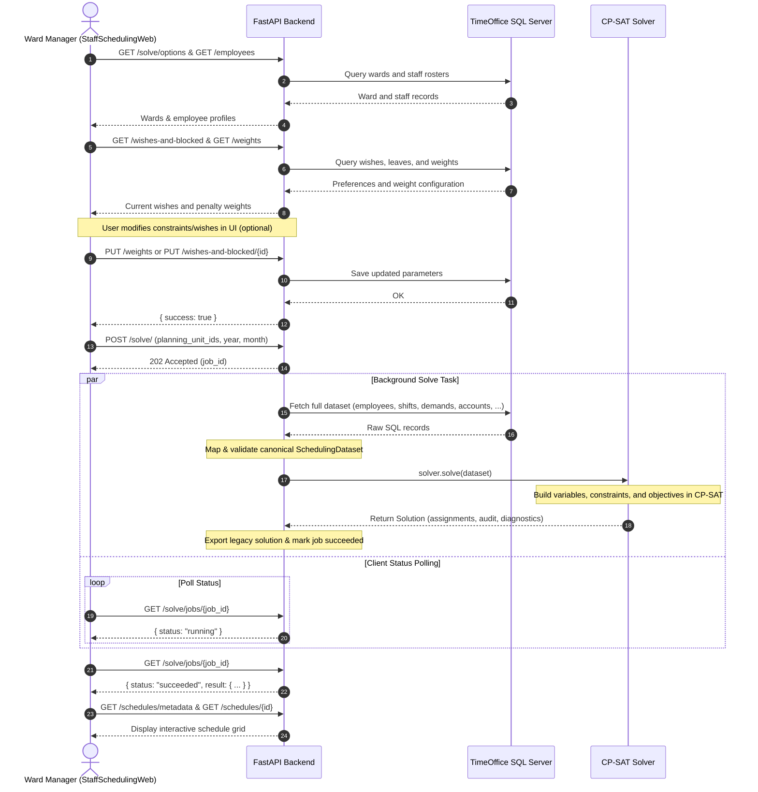

# Codebase Overview

This document provides an overview of the architecture, module organization, and core design principles of the **Staff Scheduling** project.

---

## System Interaction Workflow

The sequence diagram below illustrates how the major system components — the frontend web application (**StaffSchedulingWeb**), the **FastAPI Backend**, the **TimeOffice SQL Server**, and the **Google OR-Tools CP-SAT Solver** — interact end-to-end:



---

## Architectural Principles

The codebase follows a modular, **Domain-Driven Design (DDD)** architecture. The core domain is strictly decoupled from both the underlying TimeOffice database schema and the CP-SAT solver implementation:

* **Pure Domain Layer:** All business concepts (employees, shifts, staffing demands, leaves, wishes) are expressed as immutable, framework-agnostic models. Neither the database nor the solver dictates the domain representation.
* **Adapter Pattern for Database Integration:** The TimeOffice integration is isolated into dedicated query readers, domain mappers, and persistence writers. Database changes do not ripple into the optimization engine.
* **Component-Based Optimization:** Constraints and objectives are implemented as standalone, self-contained classes conforming to strict typing protocols (`Constraint` and `Objective`).
* **Pre-Solve Validation & Post-Solve Auditing:** Input datasets undergo thorough validation before reaching the solver, and solved schedules are independently audited against all constraints.

---

## Directory Layout

```
StaffScheduling/
├── src/
│   ├── main.py                        # CLI entry point (staff-scheduling solve)
│   └── scheduling/                    # Core application package
│       ├── domain/                    # Canonical domain models & aggregates
│       ├── timeoffice/                # TimeOffice SQL Server integration
│       │   ├── reading/               # Modular SQL query readers
│       │   ├── mapping/               # DB-to-Domain mappers
│       │   ├── writing/               # Domain-to-DB writers
│       │   ├── remapping/             # API/UI remapping utilities
│       │   ├── database.py            # SQLAlchemy engine creation
│       │   ├── facts.py               # TimeOffice constants & shift facts
│       │   └── service.py             # TimeOfficeService coordinator
│       ├── solver/                    # Optimization engine
│       │   ├── service.py             # SolverService coordinator
│       │   ├── audit.py               # Post-solve constraint audit engine
│       │   ├── diagnostics.py         # Diagnostic models
│       │   ├── models.py              # Solution models & status codes
│       │   └── cp_sat/                # Google OR-Tools CP-SAT implementation
│       │       ├── builder.py         # Model assembly pipeline
│       │       ├── context.py         # SolverContext & indexing
│       │       ├── variables.py       # Decision variable generation
│       │       ├── constraint.py      # Constraint protocol
│       │       ├── objective.py       # Objective protocol & penalty types
│       │       ├── constraints/       # Hard constraint implementations
│       │       └── objectives/        # Soft objective penalty implementations
│       ├── validation/                # Dataset integrity validation
│       ├── api/                       # FastAPI REST service
│       │   ├── app.py                 # FastAPI application factory & lifespan
│       │   ├── dependencies.py        # Runtime dependency injection
│       │   ├── solve/                 # Asynchronous solve job endpoints
│       │   └── web/                   # Endpoints for StaffSchedulingWeb UI
│       ├── settings.py                # Environment & configuration settings
│       └── logging.py                 # Centralized logging configuration
├── cases/                             # Offline test cases / JSON snapshots
├── tests/                             # Unit and integration test suite
├── docs/                              # MkDocs documentation sources
├── legacy/                            # Archived prototype implementations
├── Justfile                           # Development task runner recipes
├── pyproject.toml                     # Project dependencies, tools & packaging
└── Dockerfile                         # Container definition for dev & deployment
```

---

## Core Modules Walkthrough

### 1. Canonical Domain (`src/scheduling/domain/`)

The domain layer defines the data structures used across the application:

* **[`employee.py`](file:///c:/Users/jonas/Dev/StaffScheduling/src/scheduling/domain/employee.py):** Represents ward personnel, qualification levels (`StaffLevel.PROFESSIONAL`, `ASSISTANT`, `TRAINEE`), and station affiliations.
* **[`shift.py`](file:///c:/Users/jonas/Dev/StaffScheduling/src/scheduling/domain/shift.py):** Canonical shift definitions (Early `F`, Late `S`, Night `N`, Intermediate `Z`), including durations, start/end times, and staffing roles.
* **[`demand.py`](file:///c:/Users/jonas/Dev/StaffScheduling/src/scheduling/domain/demand.py):** Minimum required staffing counts per shift, weekday, and qualification level.
* **[`availability.py`](file:///c:/Users/jonas/Dev/StaffScheduling/src/scheduling/domain/availability.py):** Employee unavailability (vacation days, sick leave, blocked shifts).
* **[`wish.py`](file:///c:/Users/jonas/Dev/StaffScheduling/src/scheduling/domain/wish.py):** Employee preferences (desired shifts, preferred off-days).
* **[`monthly_work_account.py`](file:///c:/Users/jonas/Dev/StaffScheduling/src/scheduling/domain/monthly_work_account.py):** Target working hours and cumulative overtime balances.
* **[`dataset.py`](file:///c:/Users/jonas/Dev/StaffScheduling/src/scheduling/domain/dataset.py):** The central `SchedulingDataset` aggregate containing all domain data required to solve a planning month.
* **[`plan.py`](file:///c:/Users/jonas/Dev/StaffScheduling/src/scheduling/domain/plan.py) & [`assignment.py`](file:///c:/Users/jonas/Dev/StaffScheduling/src/scheduling/domain/assignment.py):** Roster assignments associating an employee with a shift on a specific date.

---

### 2. TimeOffice Database Layer (`src/scheduling/timeoffice/`)

Coordinates communication with the hospital's Microsoft SQL Server:

* **[`facts.py`](file:///c:/Users/jonas/Dev/StaffScheduling/src/scheduling/timeoffice/facts.py):** Static mappings of TimeOffice database primary keys (`TDienste.Prim`, station IDs, planning status codes).
* **[`reading/`](file:///c:/Users/jonas/Dev/StaffScheduling/src/scheduling/timeoffice/reading/):** Specialized query readers (`roster.py`, `demand.py`, `wishes.py`, `personnel.py`, `work_accounts.py`, `options.py`).
* **[`mapping/`](file:///c:/Users/jonas/Dev/StaffScheduling/src/scheduling/timeoffice/mapping/):** Transforms raw database rows into domain dataclasses and constructs the `SchedulingDataset`.
* **[`writing/`](file:///c:/Users/jonas/Dev/StaffScheduling/src/scheduling/timeoffice/writing/):** Safely persists generated solutions, modified wishes, demand requirements, and availability back into TimeOffice.
* **[`service.py`](file:///c:/Users/jonas/Dev/StaffScheduling/src/scheduling/timeoffice/service.py):** `TimeOfficeService` acts as the single unified façade for all database operations.

---

### 3. Solver Engine (`src/scheduling/solver/`)

Built on **Google OR-Tools CP-SAT**:

#### Service & Orchestration
* **[`service.py`](file:///c:/Users/jonas/Dev/StaffScheduling/src/scheduling/solver/service.py):** `SolverService` builds the model, runs pre-solve model inspection, executes the CP-SAT search with configured timeout/workers, extracts shift assignments, and audits the result.
* **[`audit.py`](file:///c:/Users/jonas/Dev/StaffScheduling/src/scheduling/solver/audit.py):** Evaluates solved schedules against all hard constraints and soft rules to produce an `AuditReport` with detailed findings.

#### CP-SAT Model Assembly (`cp_sat/`)
* **[`variables.py`](file:///c:/Users/jonas/Dev/StaffScheduling/src/scheduling/solver/cp_sat/variables.py):** Creates binary decision variables `x[e, u, d, s, l]` for every feasible assignment slot.
* **Hard Constraints ([`cp_sat/constraints/`](file:///c:/Users/jonas/Dev/StaffScheduling/src/scheduling/solver/cp_sat/constraints/)):**
  * `one_assignment_per_day`: At most one shift per person per calendar day.
  * `minimum_staffing`: Required number of qualified staff per shift.
  * `availabilities_constraint`: Respects approved vacations, sick leave, and blocked shifts.
  * `min_rest_time`: Mandatory 11-hour rest interval between consecutive shifts.
  * `free_day_after_night_shift_phase`: Recovery day after a night shift streak.
  * `target_working_time`: Bounded monthly contracted hours.
  * `rounds_in_early_shift`: Guarantees staff qualified for ward rounds (*Visiten*).
  * `hierarchy_of_intermediate_shifts`: Rules for auxiliary/intermediate shifts.
* **Soft Objectives ([`cp_sat/objectives/`](file:///c:/Users/jonas/Dev/StaffScheduling/src/scheduling/solver/cp_sat/objectives/)):**
  * `fair_preferences`: Maximizes wish fulfillment and distributes preferences fairly.
  * `every_second_weekend_free`: Ensures alternating weekends off.
  * `minimize_overtime`: Minimizes deviations from contracted hours.
  * `minimize_consecutive_night_shifts`: Avoids prolonged night shift streaks.
  * `not_too_many_consecutive_days`: Prevents work streaks exceeding allowed day limits.
  * `preferred_block_length`: Encourages ergonomic work block lengths.
  * `rotate_shifts_forward`: Promotes clockwise shift progression (Early $\rightarrow$ Late $\rightarrow$ Night).
  * `free_days_near_weekend` & `temporary_balance_generated_assignments`.

---

### 4. Validation (`src/scheduling/validation/`)

Before the optimization process begins, [`validate_scheduling_dataset`](file:///c:/Users/jonas/Dev/StaffScheduling/src/scheduling/validation/dataset.py) performs comprehensive cross-model integrity checks on the `SchedulingDataset`:
* Verifies planning month dates and calendar ranges.
* Ensures shift IDs referenced in demand, wishes, and rosters exist in the dataset.
* Validates employee station memberships and qualification mappings.

---

### 5. API Layer (`src/scheduling/api/`)

A **FastAPI** service designed to serve the **StaffSchedulingWeb** UI:

* **Lifespan & Runtime ([`app.py`](file:///c:/Users/jonas/Dev/StaffScheduling/src/scheduling/api/app.py)):** Manages database connection pool lifecycles and registers the `ApiRuntime`.
* **Solver Route ([`solve/router.py`](file:///c:/Users/jonas/Dev/StaffScheduling/src/scheduling/api/solve/router.py)):** Asynchronous background job queue with concurrency locking (`solve_lock`), job status querying (`/solve/jobs/{job_id}`), and available options (`/solve/options`).
* **Web Endpoints ([`web/`](file:///c:/Users/jonas/Dev/StaffScheduling/src/scheduling/api/web/)):** REST routes for employee rosters, staffing demands, objective weights, employee preferences/leaves, and saved schedule solutions.

---

## Developer Tooling & CLI

* **CLI Runner ([`src/main.py`](file:///c:/Users/jonas/Dev/StaffScheduling/src/main.py)):**
  ```bash
  uv run staff-scheduling solve <unit_id> <start_date> <end_date>
  ```
* **Development Tasks ([`Justfile`](file:///c:/Users/jonas/Dev/StaffScheduling/Justfile)):**
  * `just run`: Launches the FastAPI development server in Docker.
  * `just debug`: Runs the API with `debugpy` attached on port 5678.
  * `just test`: Executes the pytest suite.
  * `just lint` / `just format`: Code formatting and linting via Ruff.
  * `just typecheck`: Strict type verification with Pyright.
  * `just check`: Runs lint, typecheck, and tests in sequence.
