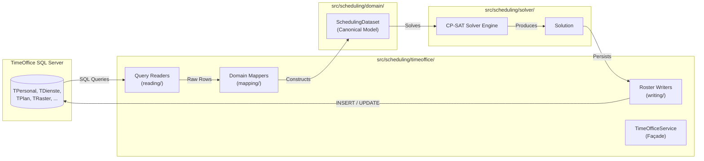

# Database Connection & TimeOffice Integration

This guide explains how the application connects to the hospital's **TimeOffice Microsoft SQL Server** database, manages credentials via `.env`, and coordinates reads and writes through the [`src/scheduling/timeoffice/`](file:///c:/Users/jonas/Dev/StaffScheduling/src/scheduling/timeoffice/) integration package.

---

## Architecture Overview

The system uses an **Adapter Pattern** to strictly isolate the TimeOffice database schema from the optimization solver. The solver never interacts with SQL Server directly; instead, all database access is mediated by the TimeOffice integration layer:



---

## Database Connection Setup

### Prerequisites

* **Python 3.12+**
* **Microsoft ODBC Driver 18 for SQL Server** installed locally (or running within the project's Docker container)
* **TimeOffice Database credentials** provided by the hospital or Pradtke GmbH

### Environment Configuration (`.env`)

Create a `.env` file in the project root (from `.env.template`) containing your connection parameters:

```env
DB_DRIVER="ODBC Driver 18 for SQL Server"
DB_SERVER=your.database.server
DB_NAME=your_database_name
DB_USER=your_username
DB_PASSWORD=your_password
```

*(Note: Never commit `.env` containing production hospital credentials to git. The `.gitignore` file excludes `.env` by default).*

### SQLAlchemy Engine Creation

Database connectivity is managed in [`src/scheduling/timeoffice/database.py`](file:///c:/Users/jonas/Dev/StaffScheduling/src/scheduling/timeoffice/database.py) using **SQLAlchemy** and **`pyodbc`**:

```python
from sqlalchemy import URL, Engine, create_engine
from scheduling.settings import Settings

def create_db_engine(settings: Settings) -> Engine:
    """Build the SQLAlchemy Engine for the TimeOffice SQL Server database."""
    url = URL.create(
        drivername="mssql+pyodbc",
        username=settings.db_user,
        password=settings.db_password.get_secret_value(),
        host=settings.db_server,
        database=settings.db_name,
        query={
            "driver": settings.db_driver,
            "TrustServerCertificate": "yes",
        },
    )
    return create_engine(url)
```

The engine uses standard SQLAlchemy connection pooling and passes `TrustServerCertificate=yes` to support internal hospital network configurations.

---

## TimeOffice Module Layout (`src/scheduling/timeoffice/`)

The database integration package is structured into clean, modular subpackages:

```
src/scheduling/timeoffice/
├── facts.py                 # TimeOffice constants, table IDs, and status codes
├── database.py              # SQLAlchemy engine creation & connection pooling
├── service.py               # TimeOfficeService coordinator façade
├── reading/                 # Parameterized SQL query readers
│   ├── personnel.py         # Staff profiles, qualifications, station affiliations
│   ├── shifts.py            # Shift definitions, durations, clock times
│   ├── roster.py            # Existing roster assignments & unavailabilities
│   ├── demand.py            # Minimum staffing quotas
│   ├── wishes.py            # Employee shift wishes & preferred off-days
│   ├── work_accounts.py     # Monthly contracted target hours & overtime balances
│   └── options.py           # Selectable stations for UI dropdowns
├── mapping/                 # Converts raw SQL tuples into canonical domain models
│   ├── dataset.py           # map_scheduling_dataset coordinator
│   ├── personnel.py         # Maps employees & station memberships
│   ├── shifts.py            # Maps shifts & staffing roles
│   ├── demand.py            # Maps staffing quotas
│   ├── roster.py            # Maps assignments & unavailabilities
│   ├── wishes.py            # Maps employee wishes
│   └── work_accounts.py     # Maps monthly work account balances
├── writing/                 # Persists solutions & user modifications back to SQL Server
│   ├── roster.py            # Writes generated schedules into TPlan / TRaster
│   ├── wishes.py            # Updates employee wishes
│   ├── demand.py            # Updates minimal staffing requirements
│   └── weights.py           # Updates objective penalty weights
└── remapping/               # DTO translation for REST API endpoints
```

---

## Mapping to the Domain Data Model

Once raw SQL rows are queried by the readers in `reading/`, they are transformed by `mapping/` into the canonical **`SchedulingDataset`**.

This separates SQL Server intricacies (like German column identifiers, status codes, and relational join tables) from the solver engine.

👉 **For complete details on domain entities (`Employee`, `Shift`, `DemandRequirement`, `Availability`, `Wish`), see the dedicated guide: [Domain Data Model](../domain-data-model.md)**.

---

## Writing Solutions Back to TimeOffice

When the solver finishes generating a schedule, [`TimeOfficeService.write_solution(...)`](file:///c:/Users/jonas/Dev/StaffScheduling/src/scheduling/timeoffice/service.py) persists the resulting assignments into TimeOffice:

1. **Target Planning Records (`TPlan`):** Inserts or updates the planning header for the given planning unit and month, marking the plan status as active.
2. **Shift Raster (`TRaster`):** Writes individual shift entries (`TDienste.Prim`) for each employee and date slot.
3. **Transaction Safety:** All writes are wrapped in database transactions so that partial failures roll back cleanly without corrupting existing roster data.
