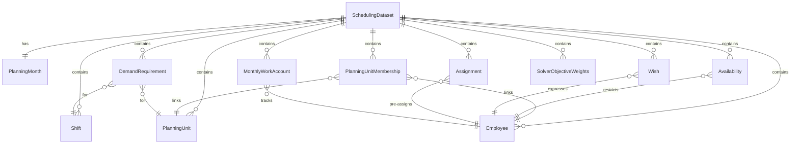

# Domain Data Model

This page documents the canonical domain models used throughout the **Staff Scheduling** application. These models are defined in [`src/scheduling/domain/`](file:///c:/Users/jonas/Dev/StaffScheduling/src/scheduling/domain/) and serve as the clean, framework-agnostic representation of all scheduling concepts.

The domain layer is the **central contract** between the TimeOffice database adapter, the validation layer, and the CP-SAT solver. Neither the database schema nor the solver internals leak through these models.

---

## The Big Picture: `SchedulingDataset`

Everything the solver needs is collected into a single [`SchedulingDataset`](file:///c:/Users/jonas/Dev/StaffScheduling/src/scheduling/domain/dataset.py) aggregate:

```python
class SchedulingDataset(SchedulingBaseModel):
    planning_month: PlanningMonth

    planning_units: tuple[PlanningUnit, ...]
    plans: tuple[Plan, ...]
    shifts: tuple[Shift, ...]

    demand_requirements: tuple[DemandRequirement, ...]

    employees: tuple[Employee, ...]
    planning_unit_memberships: tuple[PlanningUnitMembership, ...]
    sunday_work_history: tuple[EmployeeSundayWorkHistory, ...]
    wishes: tuple[Wish, ...]

    assignments: tuple[Assignment, ...]         # Pre-existing planned/external shifts
    availability: tuple[Availability, ...]      # Vacation, sick leave, blocked days

    monthly_work_accounts: tuple[MonthlyWorkAccount, ...]
    objective_weights: tuple[SolverObjectiveWeights, ...]
```

The `TimeOfficeService` constructs this from raw SQL rows, the `validate_scheduling_dataset` function checks its integrity, and the `SolverService` turns it into CP-SAT variables and constraints.

---

## Entity Reference

### `PlanningMonth`

**File:** [`planning_month.py`](file:///c:/Users/jonas/Dev/StaffScheduling/src/scheduling/domain/planning_month.py)

Represents the calendar month being scheduled. The solver always works on full calendar months.

| Field | Type | Description |
|---|---|---|
| `year` | `int` | Four-digit planning year |
| `month` | `int` | Month number (1–12) |

Provides computed properties `start` and `end` for the first and last date of the month.

---

### `PlanningUnit`

**File:** [`planning_unit.py`](file:///c:/Users/jonas/Dev/StaffScheduling/src/scheduling/domain/planning_unit.py)

Mirrors the TimeOffice concept *Planungseinheit* — an organizational unit that owns a staffing schedule.

| Field | Type | Description |
|---|---|---|
| `planning_unit_id` | `int` | Unique identifier (matches TimeOffice `TPlanungseinheiten.Prim`) |
| `display_name` | `str` | Human-readable name (e.g. `"Station 77"`) |
| `type` | `PlanningUnitType` | `STATION` (has demand, solver assigns here) or `SHARED_POOL` (cross-unit source) |

---

### `PlanningUnitMembership`

**File:** [`planning_unit.py`](file:///c:/Users/jonas/Dev/StaffScheduling/src/scheduling/domain/planning_unit.py)

Records that an employee belongs to a planning unit for a date interval. Multiple membership records per employee are valid (e.g. part-time transfers).

| Field | Type | Description |
|---|---|---|
| `planning_unit_id` | `int` | The unit the employee belongs to |
| `employee_id` | `int` | The employee |
| `valid_from` | `date` | Start of this membership interval |
| `valid_until` | `date \| None` | End of membership (`None` = indefinitely active) |
| `staff_level` | `StaffLevel` | Role the employee fills in this unit |
| `is_home` | `bool` | `True` if this is the employee's primary station |
| `is_replacement` | `bool` | `True` if this is a temporary replacement assignment |

---

### `Employee`

**File:** [`employee.py`](file:///c:/Users/jonas/Dev/StaffScheduling/src/scheduling/domain/employee.py)

Represents a schedulable member of staff. Intentionally does not expose raw TimeOffice profession IDs.

| Field | Type | Description |
|---|---|---|
| `employee_id` | `int` | Unique identifier (TimeOffice `TPersonal.Prim`) |
| `display_name` | `str` | Full name for display purposes |
| `staff_level` | `StaffLevel` | Qualification level: `PROFESSIONAL`, `ASSISTANT`, or `TRAINEE` |
| `capabilities` | `tuple[Capability, ...]` | Special skills: `NIGHT_WATCH`, `ROUNDS` |

**`StaffLevel` enum:**

| Value | German | Meaning |
|---|---|---|
| `PROFESSIONAL` | Fachkraft | Registered nurse / skilled professional |
| `ASSISTANT` | Hilfskraft | Healthcare assistant |
| `TRAINEE` | Azubi | Trainee / apprentice |

**`Capability` enum:**

| Value | Used by constraint |
|---|---|
| `NIGHT_WATCH` | Night shift eligibility |
| `ROUNDS` | `rounds_in_early_shift` — must conduct ward rounds (*Visiten*) |

---

### `Shift`

**File:** [`shift.py`](file:///c:/Users/jonas/Dev/StaffScheduling/src/scheduling/domain/shift.py)

Scheduling-relevant view of a TimeOffice shift entry. Raw shift catalog fields are not exposed.

| Field | Type | Description |
|---|---|---|
| `shift_id` | `int` | Unique shift identifier (TimeOffice `TDienste.Prim`) |
| `code` | `str` | Short code (e.g. `"F"`, `"S"`, `"N"`, `"Z"`) |
| `type` | `ShiftType` | Broad category for rule evaluation |
| `staffing_role` | `StaffingDemandRole` | How this shift counts toward demand |
| `start_minute` | `int` | Start of shift in minutes since midnight |
| `end_minute` | `int` | End of shift in minutes since midnight (may be > 1440 for overnight shifts) |
| `net_work_minutes` | `int` | Paid/planned minutes (excluding breaks) used for monthly work account balancing |

**`ShiftType` enum:**

| Value | Common code | Description |
|---|---|---|
| `EARLY` | `F` | Frühdienst — morning shift |
| `LATE` | `S` | Spätdienst — afternoon/evening shift |
| `NIGHT` | `N` | Nachtdienst — overnight shift |
| `INTERMEDIATE` | `Z` | Zwischendienst — flexible filler shift |
| `MANAGEMENT` | — | Administrative / management shift |
| `OTHER` | — | Catch-all for remaining TimeOffice shift types |

**`StaffingDemandRole` enum:**

| Value | Meaning |
|---|---|
| `REQUIRED_MINIMUM` | Fills minimum staffing demand; solver assigns variables for it |
| `OPTIONAL_COVERAGE` | Additional coverage beyond minimum; treated as intermediate shift |
| `NON_MINIMUM_WORK` | Work that does not satisfy any staffing demand (e.g. planned training) |

> **Note:** Variables are only created for shifts with `staffing_role != NON_MINIMUM_WORK`. This is enforced in [`variables.py`](file:///c:/Users/jonas/Dev/StaffScheduling/src/scheduling/solver/cp_sat/variables.py).

---

### `DemandRequirement`

**File:** [`demand.py`](file:///c:/Users/jonas/Dev/StaffScheduling/src/scheduling/domain/demand.py)

Specifies the minimum required number of staff for one shift/date/qualification combination.

| Field | Type | Description |
|---|---|---|
| `planning_unit_id` | `int` | The ward/station this demand applies to |
| `date` | `date` | Specific calendar date |
| `shift_id` | `int` | Which shift must be staffed |
| `staff_level` | `StaffLevel` | Required qualification level |
| `required_count` | `int` (> 0) | Minimum headcount |

The `minimum_staffing` hard constraint uses these records to post `sum(assignment_vars) >= required_count` for each `(planning_unit, date, shift, staff_level)` tuple.

---

### `Availability`

**File:** [`availability.py`](file:///c:/Users/jonas/Dev/StaffScheduling/src/scheduling/domain/availability.py)

A hard restriction on an employee's availability for a specific date. **Not** a preference — preferences use `Wish`.

| Field | Type | Description |
|---|---|---|
| `employee_id` | `int` | The affected employee |
| `date` | `date` | The restricted date |
| `availability_type` | `AvailabilityType` | Type of restriction |
| `shift_ids` | `tuple[int, ...] \| None` | Only for `AVAILABLE_ONLY` — lists the only permitted shifts |

**`AvailabilityType` enum:**

| Value | Source in TimeOffice | Meaning |
|---|---|---|
| `VACATION` | `RefgAbw` in (20, 2434, 2435, 2091) | Approved vacation day; reduces monthly target hours |
| `FREE_DAY` | Other `RefgAbw` values | Other full-day absence (parental leave, sick, etc.); does not reduce target |
| `UNAVAILABLE` | `RefgAbw IS NULL` (external shift) | Employee is scheduled in another planning unit |
| `TRAINING` | — | Training absence |
| `AVAILABLE_ONLY` | Pre-planned shifts | Employee is pinned to specific shifts only |

---

### `Wish`

**File:** [`wish.py`](file:///c:/Users/jonas/Dev/StaffScheduling/src/scheduling/domain/wish.py)

Represents a soft employee preference for a date. Wishes are maximized by the `fair_preferences` objective but do not make a schedule infeasible.

| Field | Type | Description |
|---|---|---|
| `employee_id` | `int` | The employee making the wish |
| `planning_unit_id` | `int` | The unit context for the wish |
| `date` | `date` | The target date |
| `type` | `WishType` | What the employee prefers |
| `shift_id` | `int \| None` | Required for shift-specific wish types |

**`WishType` enum:**

| Value | Meaning |
|---|---|
| `FREE_DAY` | Employee wants the whole day off (no shift) |
| `FREE_SHIFT` | Employee wants a specific shift on this date to be free |
| `PREFERRED_DAY` | Employee prefers to work on this date |
| `PREFERRED_SHIFT` | Employee prefers to be assigned to a specific shift on this date |

---

### `Assignment`

**File:** [`assignment.py`](file:///c:/Users/jonas/Dev/StaffScheduling/src/scheduling/domain/assignment.py)

An existing TimeOffice assignment imported *before* the solver runs. These are not the solver's output — they are pre-existing data that constrain the solver.

| Field | Type | Description |
|---|---|---|
| `employee_id` | `int` | The assigned employee |
| `date` | `date` | The assignment date |
| `shift_id` | `int` | The shift being worked |
| `assignment_type` | `AssignmentType` | `PLANNED`, `EXTERNAL`, or `GENERATED` |
| `planning_unit_id` | `int \| None` | Set only for `PLANNED` assignments |

**`AssignmentType` enum:**

| Value | Meaning |
|---|---|
| `PLANNED` | Already scheduled in one of the selected planning units — treated as a fixed assignment by the solver |
| `EXTERNAL` | Employee is working in a *different* planning unit on this date — blocks them from being assigned here |
| `GENERATED` | Produced by this solver run (used for post-solve output) |

---

### `MonthlyWorkAccount`

**File:** [`monthly_work_account.py`](file:///c:/Users/jonas/Dev/StaffScheduling/src/scheduling/domain/monthly_work_account.py)

Tracks an employee's contracted target hours and any hours already recorded for the planning month.

| Field | Type | Description |
|---|---|---|
| `employee_id` | `int` | The employee |
| `target_minutes` | `int` (≥ 0) | Monthly contracted working minutes (from `TPersonalKontenJeMonat` Konto 1) |
| `actual_minutes` | `int \| None` | Already-recorded working minutes (Konto 19 or 55); `None` if no actuals yet |

Used by the `target_working_time` constraint and the `minimize_overtime` objective to enforce and penalize deviations from the monthly contracted hours.

---

### `SolverObjectiveWeights`

**File:** [`objective_weights.py`](file:///c:/Users/jonas/Dev/StaffScheduling/src/scheduling/domain/objective_weights.py)

Per-planning-unit weight configuration for soft objectives. All fields default to sensible values via `SolverObjectiveWeights.default_for_planning_unit(id)`.

| Field | Default | Objective it controls |
|---|:---:|---|
| `employee_wish` | `3` | `fair_preferences` — granting shift wishes |
| `overtime_penalty` | `4` | `minimize_overtime` — deviation from contracted hours |
| `fairness` | `3` | `fair_preferences` — equitable wish distribution |
| `free_weekend` | `3` | `free_days_near_weekend` |
| `second_weekend_penalty` | `1` | `every_second_weekend_free` |
| `consecutive_night_shifts` | `2` | `minimize_consecutive_night_shifts` |
| `recovery_after_night_shift` | `3` | `free_days_after_night_shift_phase` |
| `consecutive_working_days` | `1` | `not_too_many_consecutive_days` |
| `shift_rotation` | `1` | `rotate_shifts_forward` |
| `hidden_employee` | `100` | `temporary_balance_generated_assignments` |

Weights are stored in TimeOffice and can be changed via `PUT /weights` or by editing `cases/{case_id}/{MM_YYYY}/weights.json`.

---

## Relationships at a Glance


