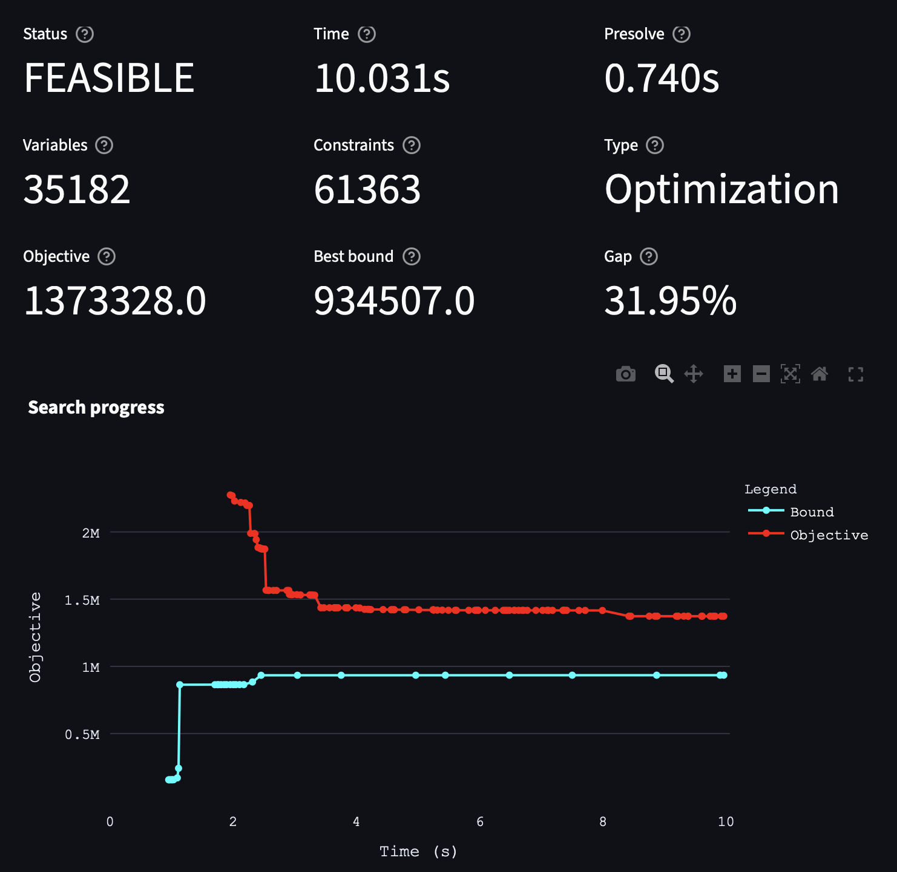
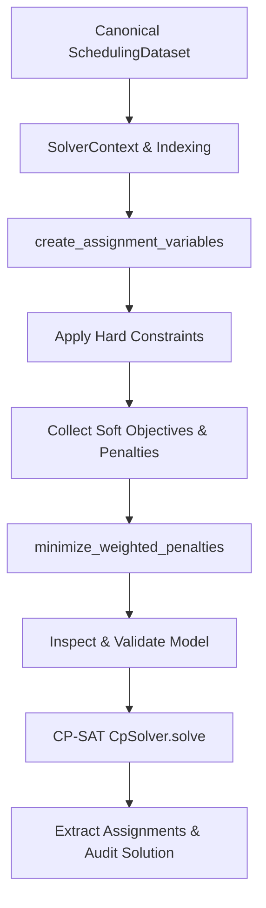

# Google OR-Tools and CP-SAT Solver

Hospital staff scheduling is a classic **combinatorial optimization problem**. With dozens of employees, multiple shift types, qualification hierarchies, and a month of planning days, the number of possible rosters is astronomical. Brute-force search is impossible; instead, this project uses **Google OR-Tools CP-SAT** to find provably optimal or near-optimal feasible schedules in seconds.

!!! tip "Visualizing and Understanding the Solve Process"
    The **[CP-SAT-Log-Analyzer](https://github.com/d-krupke/CP-SAT-Log-Analyzer)** is a great tool to visualize and understand the solver's behavior. It is available online at **[cpsat-log-analyzer.streamlit.app](https://cpsat-log-analyzer.streamlit.app)**.

    To generate the solver log, set `SOLVER_LOG_SEARCH_PROGRESS=true` in your `.env` file and run the solver. You can then upload or paste the solver output directly into the analyzer.

    { width="380" }

---

## What is SAT and CP-SAT?

### Boolean Satisfiability (SAT)
At its mathematical core, **SAT** asks: *Given a Boolean formula over variables (x₁, x₂, ..., xₙ), does there exist a truth assignment (True/False) that satisfies the entire formula?*

Modern SAT solvers use **CDCL (Conflict-Driven Clause Learning)**:
1. **Decision:** Speculatively assign a variable (e.g. "Employee A works the Night shift on Day 5").
2. **Propagation:** Deduce forced consequences based on active constraints (e.g. "Employee A cannot work the Early shift on Day 6 due to the 11-hour rest rule").
3. **Conflict & Learning:** If a contradiction is reached (e.g. no qualified staff remains for the Early shift), analyze the mathematical cause of the conflict, record a "learned clause" to avoid exploring similar invalid states, and backtrack.
4. **Iterate:** Continue until a valid assignment is found or the problem is proven mathematically unsatisfiable.

### Constraint Programming (CP) + SAT
**CP-SAT** combines SAT's conflict-driven search engine with **Constraint Programming (CP)** techniques like domain propagation, linear inequalities, and interval scheduling. This allows the solver to handle:
* Integer arithmetic (e.g. monthly working hour balances, staffing counts).
* Conditional enforcement (`only_enforce_if` for implications).
* Multi-objective linear penalty minimization.

---

## How CP-SAT is Structured in This Project

In this repository, the solver architecture is strictly separated from the TimeOffice database and REST API, living inside [`src/scheduling/solver/cp_sat/`](file:///c:/Users/jonas/Dev/StaffScheduling/src/scheduling/solver/cp_sat/).

### 1. Decision Variables

The primary decision variables represent shift assignments. They are created in [`src/scheduling/solver/cp_sat/variables.py`](file:///c:/Users/jonas/Dev/StaffScheduling/src/scheduling/solver/cp_sat/variables.py):

`x[e, u, d, s, l] ∈ {0, 1}`

Where:

* `e`: Employee ID
* `u`: Planning Unit ID (station/ward)
* `d`: Calendar date
* `s`: Shift ID (Early `F`, Late `S`, Night `N`, Intermediate `Z`)
* `l`: Staff qualification role filled (e.g. `Fachkraft`, `Hilfskraft`, `Azubi`)

Each variable is stored as a Boolean variable in `ctx.assignment_variables` indexed by the tuple `(employee_id, planning_unit_id, date, shift_id, staff_level)`.

To reduce problem size, variables are **only created for eligible slots** — employees are never assigned variables for dates they do not belong to the station or roles they lack qualifications for.

---

### 2. Hard Constraints vs. Soft Objectives

The project strictly distinguishes between rules that **must** be obeyed versus ergonomic/preference goals that **should** be maximized:

| Type | Base Protocol | Behavior | Examples |
|---|---|---|---|
| **Hard Constraints** | [`Constraint`](file:///c:/Users/jonas/Dev/StaffScheduling/src/scheduling/solver/cp_sat/constraint.py) | Added directly to `ctx.model.add(...)`. Any schedule violating them is rejected as **infeasible**. | • One shift per day per person<br>• Minimum required staffing per shift<br>• 11-hour rest interval between shifts<br>• Monthly contracted target hours<br>• Free day after a night shift block |
| **Soft Objectives** | [`Objective`](file:///c:/Users/jonas/Dev/StaffScheduling/src/scheduling/solver/cp_sat/objective.py) | Evaluated into integer `Penalty` expressions and minimized as a weighted sum. | • Fulfill employee shift wishes<br>• Ensure alternating weekends off<br>• Minimize consecutive night shifts<br>• Forward clockwise shift rotation (F $\rightarrow$ S $\rightarrow$ N)<br>• Fair distribution of wishes |

The solver minimizes the global objective function:

`minimize: Total Penalty = Σ (weight_i × Penalty_i)`

Where `weight_i` is the multiplier configured in `/weights` and `Penalty_i` is the penalty expression for objective `i`.

---

### 3. The Model Build Pipeline

The model builder in [`src/scheduling/solver/cp_sat/builder.py`](file:///c:/Users/jonas/Dev/StaffScheduling/src/scheduling/solver/cp_sat/builder.py) orchestrates the construction:



1. **Context Initialization:** `create_context(dataset)` constructs high-performance lookups (indexing shifts by ID, employees by planning unit, dates in the month).
2. **Variable Creation:** `create_assignment_variables(ctx)` instantiates Boolean decision variables in the CP-SAT `CpModel`.
3. **Hard Constraints:** Iterates over `CP_SAT_CONSTRAINTS` calling `constraint.add_to_model(ctx, params)`.
4. **Soft Objectives:** Iterates over `CP_SAT_OBJECTIVES` calling `objective.add_to_model(ctx, params)` and registers the total weighted penalty via `model.minimize(...)`.
5. **Inspection & Pre-Check:** [`inspect_cp_sat_model(ctx)`](file:///c:/Users/jonas/Dev/StaffScheduling/src/scheduling/solver/cp_sat/inspection.py) ensures no model variables are disconnected or malformed before launching the solver.
6. **Post-Solve Audit:** [`AuditReport`](file:///c:/Users/jonas/Dev/StaffScheduling/src/scheduling/solver/audit.py) re-verifies that the resulting assignments satisfy all constraints independently.

---

## Configuration & Solver Tuning

Solver options are configured through environment variables or the `.env` file via [`Settings`](file:///c:/Users/jonas/Dev/StaffScheduling/src/scheduling/settings.py):

| Setting | Default | Description |
|---|---|---|
| `SOLVER_MAX_TIME_SECONDS` | `30` | Maximum solver search time in seconds before returning the best solution found. |
| `SOLVER_NUM_SEARCH_WORKERS` | `None` (auto) | Number of parallel search threads. CP-SAT uses different search strategies on different threads. |
| `SOLVER_RANDOM_SEED` | `None` | Random seed for deterministic reproducibility. |
| `SOLVER_LOG_SEARCH_PROGRESS` | `false` | When set to `true`, prints real-time CP-SAT solver branch-and-bound logs to stdout. |

Example `.env` configuration:

```env
SOLVER_MAX_TIME_SECONDS=60
SOLVER_NUM_SEARCH_WORKERS=8
SOLVER_LOG_SEARCH_PROGRESS=true
```

---

## Visualizing Solver Progress (CP-SAT Log Analyzer)

When `SOLVER_LOG_SEARCH_PROGRESS=true` is enabled, CP-SAT outputs search progress containing bound improvements, search worker statistics, and conflict counts:

```
#1       0.02s best:125   next:[1..124]  initial_solution
#2       0.05s best:84    next:[1..83]   linear_relaxation
#3       0.12s best:42    next:[1..41]   feasibility_pump
...
```

You can inspect this search trajectory using the **[CP-SAT Log Analyzer](https://github.com/d-krupke/CP-SAT-Log-Analyzer)**:
* **Online Tool:** [https://cpsat-log-analyzer.streamlit.app](https://cpsat-log-analyzer.streamlit.app)
* Simply copy the solver console logs into the analyzer to plot bound progressions, identify search bottlenecks, and check whether tightening solver timeouts or adding search workers improves schedule quality.

---

## CP-SAT Code Reference

Below are common OR-Tools patterns used when writing constraints or objectives:

### 1. Basic Boolean Variables and Sums

```python
from ortools.sat.python import cp_model

model = cp_model.CpModel()

# Create boolean variables
x = model.new_bool_var("emp1_day1_shiftF")
y = model.new_bool_var("emp1_day1_shiftS")

# At most one shift per day (x + y <= 1)
model.add_at_most_one([x, y])

# Or exactly one shift
model.add_exactly_one([x, y])
```

### 2. Implication and Conditional Enforcement

```python
# If employee works night shift (night == 1), then next day early shift must be 0
night_day1 = model.new_bool_var("night_d1")
early_day2 = model.new_bool_var("early_d2")

# "night_day1 implies NOT early_day2"
model.add(early_day2 == 0).only_enforce_if(night_day1)

# Equivalent boolean clause: NOT night_day1 OR NOT early_day2
model.add_bool_or([night_day1.Not(), early_day2.Not()])
```

### 3. Bounded Linear Expressions (Target Working Hours)

```python
# Sum of shift durations must equal monthly target
total_minutes = model.new_int_var(0, 30000, "total_minutes")
model.add(total_minutes == sum(duration * var for duration, var in shift_vars))

# Bound between min and max allowed hours
model.add(total_minutes >= target_min)
model.add(total_minutes <= target_max)
```
