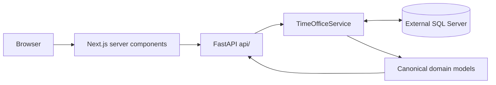

# Architecture and contracts

The repository contains a Python API, a Next.js webapp and one MkDocs documentation project. FastAPI owns the canonical scheduling domain and solver; TimeOffice-specific SQL, identifiers and translations stay in its adapter. The selection/employee slice uses direct canonical server reads; remaining imported views still contain compatibility code.

## Who this section serves

For developers and technical reviewers tracing responsibilities and data flow. This is a source-inspected map, not proof of connected operation. Read the [domain](domain.md) for scheduling terms and units, [API](api.md) for HTTP boundaries, [solver](solver.md) for the model and [TimeOffice adapter](timeoffice.md) for external dependencies.

## Repository map

```text
.
├── compose.yaml              # API/webapp development startup and mounts
├── .env                      # non-secret database connection settings
├── .secrets/                 # ignored local password file
├── Justfile                  # shared install/check/docs/Compose recipes
├── api/
│   ├── app/
│   │   ├── main.py           # FastAPI construction and runtime lifespan
│   │   ├── settings.py       # environment and secret loading
│   │   ├── api/              # HTTP routes only
│   │   ├── domain/           # canonical models and domain rules, e.g. inspection
│   │   ├── solver/           # CP-SAT engine (not yet wired to a route)
│   │   └── timeoffice/       # adapter: TimeOfficeService facade; queries.py, facts.py, database.py inside
│   ├── tests/
│   ├── pyproject.toml
│   ├── uv.lock
│   └── .python-version
├── webapp/
│   ├── src/
│   │   ├── app/              # App Router pages, route-local components, /api/health
│   │   ├── components/       # shell, planning picker and ui/ primitives
│   │   └── lib/              # server-only API fetches, response types, scope parsing
│   ├── tests/browser/        # Playwright staff-admin flows
│   ├── package.json
│   ├── pnpm-lock.yaml
│   └── pnpm-workspace.yaml   # single-package settings/build approvals
├── docs/
│   ├── source/               # documentation content
│   ├── mkdocs.yml
│   ├── pyproject.toml
│   └── uv.lock
└── data/                     # persistent runtime files; empty on checkout
```

Service Dockerfiles live alongside their manifests. Generated environments, dependencies, `docs/site/`, webapp build output, secrets and runtime data are ignored. There is no root Node workspace or Python package.

## Request flow



Next.js server components call the API at `API_URL`; Compose sets it to `http://api:8000`. Browser traffic enters the webapp. `api/app/main.py` builds the SQLAlchemy engine and the TimeOffice service; shutdown disposes the engine.

The solver engine depends only on `domain/`; the generation slice will connect it through a route and the adapter. The [API reference](api.md) describes the current routes.

## Where to make a change

| Change                              | Start here                                                                |
| ----------------------------------- | ------------------------------------------------------------------------- |
| API request/response                | `api/app/api/`, `main.py`                                                 |
| Scheduling concept or domain rule   | `api/app/domain/`                                                         |
| Constraint/objective or solving     | `api/app/solver/cp_sat/`, `solver/config.py`, `solver/service.py`         |
| TimeOffice query or translation     | `api/app/timeoffice/queries.py`, `facts.py`, `service.py`                 |
| Screen behavior                     | `webapp/src/app/<route>/` and shared `webapp/src/components/`             |
| Webapp API calls and response types | `webapp/src/lib/api.ts`, `webapp/src/lib/types.ts`                        |
| Runtime/dependency pins             | service manifests/locks, Dockerfiles and consuming workflow/tool settings |
| Documentation                       | `docs/source/` and `docs/mkdocs.yml`                                      |

Trace the real callers before changing a boundary. Keep TimeOffice terminology inside the adapter and use the canonical backend models for new behavior. Read [domain](domain.md), [solver](solver.md), [TimeOffice](timeoffice.md) and [development checks](../development/checks.md) for details. The [limitations](../validation/index.md) page records remaining compatibility work.

## Selection and inspection boundary

The webapp follows plain App Router conventions. Pages are server components that read `month`/`stations` from `searchParams`, load data through `lib/api.ts` and pass it to small client components. `lib/scope.ts` validates the URL and loads the month's stations; stations unavailable in the month are dropped by a server redirect. The picker only changes the URL. `app/employees/` loads all selected stations together inside a Suspense boundary keyed by scope, so a new scope shows its loading state instead of the previous result. Search, filter and expanded details are local interaction state. Backend `domain/inspection.py` validates completeness; the concrete TimeOffice adapter resolves target plans and reads membership/master/account/absence sources and prepared evidence. Only home and employee inspection are implemented; the sidebar shows every other area greyed out as not yet supported, without routes.

UI conventions for every page:

- Pages render `PageHeader` with a title, a one-line description and the planning selection. Every page below the overview passes `parent`, which shows a back arrow before the title; it returns to the parent page and keeps the month/station selection.
- The URL is the only selection state. A missing or invalid month means January of the current year; navigation links carry the selection.
- Unsupported areas stay visible in the sidebar as greyed, route-less entries with a tooltip; they never link to placeholder pages.
- Use the domain's German terms consistently: Verfügbarkeit (wishes and hard restrictions), Zuordnungen (dated unit assignments), Mindestbesetzung, Dienstplan.

The offline browser fixture substitutes SQL query results, while using the actual FastAPI routes, TimeOffice queries and Next.js pages. It is test infrastructure, never a production data fallback. [Testing](../development/testing.md#staff-admin-browser-flows) describes reproduction and limitations.
