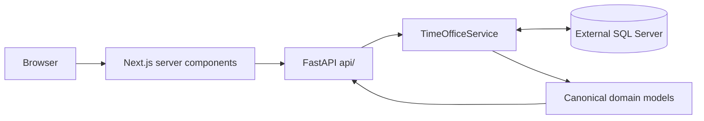

# Architecture and contracts

The repository contains a Python API, a Next.js webapp and one MkDocs documentation project. FastAPI owns the canonical scheduling domain and solver; TimeOffice-specific SQL, identifiers and translations stay in its adapter. Selection, monthly configuration and generation are rebuilt on canonical API reads and writes; no imported compatibility views remain.

## Who this section serves

For developers and technical reviewers tracing responsibilities and data flow. This is a source-inspected map, not proof of connected operation. Read the [domain](domain.md) for scheduling terms and units, [API](api.md) for HTTP boundaries, [solver](solver.md) for the model and [TimeOffice adapter](timeoffice.md) for external dependencies.

## Repository map

```text
.
├── compose.yaml              # API/webapp development startup and mounts
├── .env                      # non-secret database connection settings
├── .secrets/                 # local password file (ignored; only .gitkeep is tracked)
├── Justfile                  # shared install/check/docs/Compose recipes
├── api/
│   ├── app/
│   │   ├── main.py           # FastAPI construction and runtime lifespan
│   │   ├── settings.py       # environment and secret loading
│   │   ├── api/              # HTTP routes only
│   │   ├── domain/           # canonical models, rules, inspection, schedule check and tables
│   │   ├── solver/           # CP-SAT model, solve service, generation job, review and portable bundles
│   │   └── timeoffice/       # adapter: TimeOfficeService facade; queries.py, project_tables.py, facts.py inside
│   ├── sql/                  # explicit setup of the project tables
│   ├── tests/
│   ├── pyproject.toml
│   ├── uv.lock
│   └── .python-version
├── webapp/
│   ├── src/
│   │   ├── app/              # App Router pages, route-local components, /api/health
│   │   ├── components/       # shell, planning picker and ui/ primitives
│   │   └── lib/              # server-only API calls, types, labels, scope parsing
│   ├── tests/browser/        # Playwright staff-admin flows
│   ├── package.json
│   ├── pnpm-lock.yaml
│   └── pnpm-workspace.yaml   # single-package settings/build approvals
├── docs/
│   ├── source/               # documentation content
│   ├── mkdocs.yml
│   ├── pyproject.toml
│   └── uv.lock
└── data/                     # persistent runtime files; empty on checkout
```

Service Dockerfiles live alongside their manifests. Generated environments, dependencies, `docs/site/`, webapp build output, secrets and runtime data are ignored. There is no root Node workspace or Python package.

## Request flow



Next.js server components call the API at `API_URL`; Compose sets it to `http://api:8000`. Browser traffic enters the webapp. `api/app/main.py` builds the SQLAlchemy engine and the TimeOffice service; shutdown disposes the engine.

The solver engine depends only on `domain/`. `main.py` connects it to the adapter through `solver/generation.py`: `POST /generation` reads the input with `TimeOfficeService.read_generation_input` and solves it in a background thread. The [API reference](api.md) describes the current routes.

## Where to make a change

| Change                              | Start here                                                                                |
| ----------------------------------- | ----------------------------------------------------------------------------------------- |
| API request/response                | `api/app/api/<feature>.py` (routes and their protocol), `shared.py`, `main.py`            |
| Scheduling concept or domain rule   | `api/app/domain/`                                                                         |
| Hard rule, objective or solving     | `api/app/domain/rules.py`, `domain/acceptance.py`, `solver/model.py`, `solver/service.py` |
| TimeOffice query or translation     | `api/app/timeoffice/queries.py`, `facts.py`, `service.py`                                 |
| Project table read or write         | `api/app/timeoffice/project_tables.py`, `api/sql/supplemental-tables.sql`                 |
| Screen behavior                     | `webapp/src/app/<route>/` and shared `webapp/src/components/`                             |
| Webapp API calls and response types | `webapp/src/lib/api.ts`, `webapp/src/lib/types.ts`                                        |
| Runtime/dependency pins             | service manifests/locks, Dockerfiles and consuming workflow/tool settings                 |
| Documentation                       | `docs/source/` and `docs/mkdocs.yml`                                                      |

Trace the real callers before changing a boundary. Keep TimeOffice terminology inside the adapter and use the canonical backend models for new behavior. Read [domain](domain.md), [solver](solver.md), [TimeOffice](timeoffice.md) and [development checks](../development/checks.md) for details. Domain terms are defined in the repository's `GLOSSARY.md`; decisions that are hard to reverse are recorded in `docs/adr/` (for example, why the webapp was rebuilt rather than adapted, why TimeOffice sits behind one service, why monthly configuration lives in project tables, why generation jobs live in one API process, why credits come from TimeOffice's daily absence accounts, and why publication writes marked duties into TimeOffice target plans). The [limitations](../validation/index.md) page records remaining compatibility work.

## Selection and inspection boundary

The webapp follows plain App Router conventions. Pages are server components that read `month`/`stations` from `searchParams`, load data through `lib/api.ts` and pass it to small client components. `lib/scope.ts` validates the URL and loads the month's stations; stations unavailable in the month are dropped by a server redirect. The picker only changes the URL. `app/employees/` loads all selected stations together inside a Suspense boundary keyed by scope, so a new scope shows its loading state instead of the previous result. Search, filter and expanded details are local interaction state. Backend `domain/inspection.py` validates completeness; the concrete TimeOffice adapter resolves target plans and reads membership, master, account, daily credit and absence sources. `app/availability/` and `app/staffing/` follow the same pattern for monthly configuration: the server page loads the canonical read, a client component owns unsaved edits (`staffing/demand-grid.ts` keeps the unsaved demand cells, their changes against the saved month and pattern merge behind a few functions), and server actions in `actions.ts` call the API writes and revalidate the page. `app/generation/` renders the latest job on the server; a small client component refreshes the page every two seconds while the job runs, and the start button calls a server action. `app/review/` renders the schedule under review with its actions (publish, download, import, remove in `review-actions.tsx`), grid and accounts; the grid compares each duty's dated `origin_unit_id` with its `planning_unit_id` and never infers a home from memberships. Home, employees, availability, staffing, generation and review with publication are the whole webapp; the sidebar links exactly these areas.

UI conventions for every page:

- Pages render `PageHeader` with only a title and the planning selection, so the header stays the same height and alignment everywhere; what each page is for is said once, on the overview cards. Every page below the overview passes `parent`, which shows a back arrow before the title; it returns to the parent page and keeps the month/station selection.
- The URL is the only selection state. A missing or invalid month means January of the current year; navigation links carry the selection.
- The sidebar lists only implemented areas; there are no placeholder pages or disabled entries.
- Use the domain's German terms consistently: Verfügbarkeit (page for availability entries, called Einschränkung, and wishes), Abwesenheit (native TimeOffice absence), Zuordnungen (dated unit assignments), Mindestbesetzung, Wochenmuster, Dienstplan, Herkunft (a duty's dated origin). The solver's relative gap is the _Optimalitätslücke_; never call it just "Lücke", which reads as missing staff.
- Unsaved edits are marked per field, not only by a page-wide notice, with a cue beyond colour (border weight, bold digits) and an accessible description; saving or resetting clears the marks.
- Markers never rely on colour or hover alone: pair a colour with a shape or text (a dashed border for a transfer), explain it in the legend and repeat details in screen-reader text.
- Design for the staff admin: a page leads with what they decide and do (status, the one primary action), secondary actions (download, import, removal) open small panels, and solver diagnostics sit in one collapsed `Disclosure` (_Technische Details_). Required results, findings and missing inputs stay visible.
- A grid repeats nothing its row or column already says: a duty shows its shift only and is marked only where it differs (a transfer).
- Cards span the full content width; side-by-side layouts (overview tiles, calendar and editor) fill the row together. Do not cap single cards with a maximum width.
- A page-local choice such as the employee or station lives in the URL next to the selection (`employee=`, `station=`).
- A failed save shows the error and keeps the user's input; success is shown only after the API confirmed the write.
- Tables hold plain text; badges are only for short lists such as units. Employee lists show the ID before the name and stay sorted by name.
- Controls in the page header keep a predictable width: the station picker shows a count ("2 Stationen"), not the names.
- An editor opens on a sensible default (the first day of the month) instead of an empty "nothing selected" state.
- State a page-wide fact such as "nur lesend" once, and keep button labels short verbs ("Starten", "Speichern").
- Show work accounts in hours and minutes (`formatHours`, e.g. "160:00 h") and use one set of account terms everywhere: Soll, Ist, Gutschriften, Geplant, Saldo. Do not show backend provenance strings or raw IDs (such as shift IDs); show what they mean in German or leave them out.

The offline browser fixture substitutes SQL query results, while using the actual FastAPI routes, TimeOffice queries and Next.js pages. It is test infrastructure, never a production data fallback. [Testing](../development/testing.md#staff-admin-browser-flows) describes reproduction and limitations.
