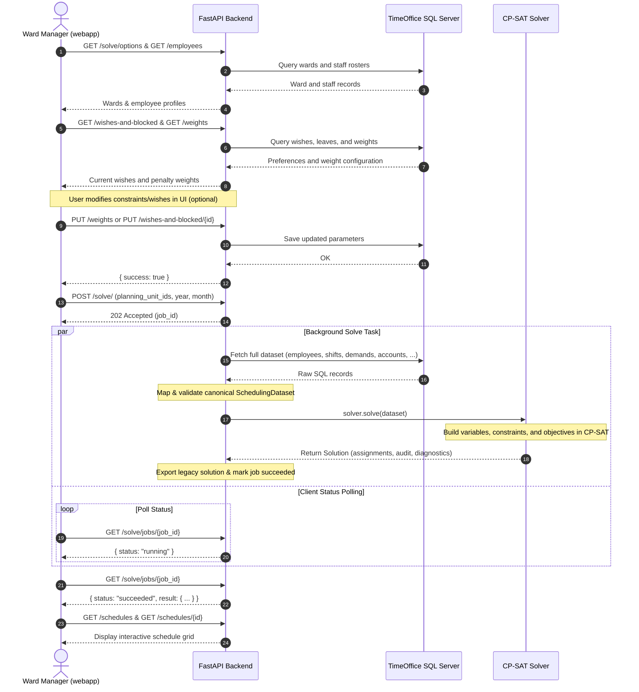

# Codebase Overview

This document provides an overview of the architecture, module organization, and core design principles of the **Staff Scheduling** project.

---

## System Interaction Workflow

The sequence diagram below illustrates how the major system components — the frontend web application (**webapp**), the **FastAPI Backend**, the **TimeOffice SQL Server**, and the **Google OR-Tools CP-SAT Solver** — interact end-to-end:



---

## Architectural Principles

The codebase follows a modular, **Domain-Driven Design (DDD)** architecture. The core domain is strictly decoupled from both the underlying TimeOffice database schema and the CP-SAT solver implementation:

- **Pure Domain Layer:** All business concepts (employees, shifts, staffing demands, leaves, wishes) are expressed as immutable, framework-agnostic models. Neither the database nor the solver dictates the domain representation.
- **Adapter Pattern for Database Integration:** The TimeOffice integration is isolated into dedicated query readers, domain mappers, and persistence writers. Database changes do not ripple into the optimization engine.
- **Component-Based Optimization:** Constraints and objectives are implemented as standalone, self-contained classes conforming to strict typing protocols (`Constraint` and `Objective`).
- **Pre-Solve Validation & Post-Solve Auditing:** Input datasets undergo thorough validation before reaching the solver, and solved schedules are audited by the existing solver audit; independent acceptance validation remains pending.

---

## Directory Layout

```text
StaffScheduling/
├── api/
│   ├── app/
│   │   ├── main.py        # FastAPI application and lifespan
│   │   ├── cli.py         # python -m app.cli
│   │   ├── dependencies.py
│   │   ├── routers/       # Solve jobs and web-facing API endpoints
│   │   ├── domain/        # Canonical scheduling data
│   │   ├── solver/        # CP-SAT model, constraints and objectives
│   │   ├── timeoffice/    # Readers, mapping and transactional writers
│   │   ├── validation/
│   │   ├── settings.py
│   │   └── logging.py
│   ├── tests/
│   ├── pyproject.toml
│   ├── uv.lock
│   └── Dockerfile
├── webapp/
│   ├── src/              # Next.js app, components, features and imported layers
│   ├── public/
│   ├── package.json
│   └── package-lock.json
├── docs/
│   ├── mkdocs.yml
└── Justfile
```

---

## Core Modules Walkthrough

### 1. Canonical Domain (`api/app/domain/`)

The domain layer defines the data structures used across the application:

- **[`employee.py`](https://github.com/CombiRWTH/StaffScheduling/blob/main/api/app/domain/employee.py):** Represents ward personnel, qualification levels (`StaffLevel.PROFESSIONAL`, `ASSISTANT`, `TRAINEE`), and station affiliations.
- **[`shift.py`](https://github.com/CombiRWTH/StaffScheduling/blob/main/api/app/domain/shift.py):** Canonical shift definitions (Early `F`, Late `S`, Night `N`, Intermediate `Z`), including durations, start/end times, and staffing roles.
- **[`demand.py`](https://github.com/CombiRWTH/StaffScheduling/blob/main/api/app/domain/demand.py):** Minimum required staffing counts per shift, weekday, and qualification level.
- **[`availability.py`](https://github.com/CombiRWTH/StaffScheduling/blob/main/api/app/domain/availability.py):** Employee unavailability (vacation days, sick leave, blocked shifts).
- **[`wish.py`](https://github.com/CombiRWTH/StaffScheduling/blob/main/api/app/domain/wish.py):** Employee preferences (desired shifts, preferred off-days).
- **[`monthly_work_account.py`](https://github.com/CombiRWTH/StaffScheduling/blob/main/api/app/domain/monthly_work_account.py):** Target working hours and cumulative overtime balances.
- **[`dataset.py`](https://github.com/CombiRWTH/StaffScheduling/blob/main/api/app/domain/dataset.py):** The central `SchedulingDataset` aggregate containing all domain data required to solve a planning month.
- **[`plan.py`](https://github.com/CombiRWTH/StaffScheduling/blob/main/api/app/domain/plan.py) & [`assignment.py`](https://github.com/CombiRWTH/StaffScheduling/blob/main/api/app/domain/assignment.py):** Roster assignments associating an employee with a shift on a specific date.

---

### 2. TimeOffice Database Layer (`api/app/timeoffice/`)

Coordinates communication with the hospital's Microsoft SQL Server:

- **[`facts.py`](https://github.com/CombiRWTH/StaffScheduling/blob/main/api/app/timeoffice/facts.py):** Static mappings of TimeOffice database primary keys (`TDienste.Prim`, station IDs, planning status codes).
- **[`reading/`](https://github.com/CombiRWTH/StaffScheduling/blob/main/api/app/timeoffice/reading/):** Specialized query readers (`roster.py`, `demand.py`, `wishes.py`, `personnel.py`, `work_accounts.py`, `options.py`).
- **[`mapping/`](https://github.com/CombiRWTH/StaffScheduling/blob/main/api/app/timeoffice/mapping/):** Transforms raw database rows into domain dataclasses and constructs the `SchedulingDataset`.
- **[`writing/`](https://github.com/CombiRWTH/StaffScheduling/blob/main/api/app/timeoffice/writing/):** Safely persists generated solutions, modified wishes, demand requirements, and availability back into TimeOffice.
- **[`service.py`](https://github.com/CombiRWTH/StaffScheduling/blob/main/api/app/timeoffice/service.py):** `TimeOfficeService` acts as the single unified façade for all database operations.

---

### 3. Solver Engine (`api/app/solver/`)

Built on **Google OR-Tools CP-SAT**:

#### Service & Orchestration

- **[`service.py`](https://github.com/CombiRWTH/StaffScheduling/blob/main/api/app/solver/service.py):** `SolverService` builds the model, runs pre-solve model inspection, executes the CP-SAT search with configured timeout/workers, extracts shift assignments, and audits the result.
- **[`audit.py`](https://github.com/CombiRWTH/StaffScheduling/blob/main/api/app/solver/audit.py):** Evaluates solved schedules against all hard constraints and soft rules to produce an `AuditReport` with detailed findings.

#### CP-SAT Model Assembly (`cp_sat/`)

- **[`variables.py`](https://github.com/CombiRWTH/StaffScheduling/blob/main/api/app/solver/cp_sat/variables.py):** Creates binary decision variables `x[e, u, d, s, l]` for every feasible assignment slot.
- **Hard Constraints ([`cp_sat/constraints/`](https://github.com/CombiRWTH/StaffScheduling/blob/main/api/app/solver/cp_sat/constraints/)):**
  - `one_assignment_per_day`: At most one shift per person per calendar day.
  - `minimum_staffing`: Required number of qualified staff per shift.
  - `availabilities_constraint`: Respects approved vacations, sick leave, and blocked shifts.
  - `free_day_after_night_shift_phase`: Enforces the mandatory recovery day after a night shift streak (also covers the 11-hour rest rule implicitly via shift time windows).
  - `target_working_time`: Bounded monthly contracted hours.
  - `rounds_in_early_shift`: Guarantees staff qualified for ward rounds (_Visiten_).
  - `hierarchy_of_intermediate_shifts`: Rules for auxiliary/intermediate shifts.
- **Soft Objectives ([`cp_sat/objectives/`](https://github.com/CombiRWTH/StaffScheduling/blob/main/api/app/solver/cp_sat/objectives/)):**
  - `fair_preferences`: Maximizes wish fulfillment and distributes preferences fairly.
  - `every_second_weekend_free`: Ensures alternating weekends off.
  - `minimize_overtime`: Minimizes deviations from contracted hours.
  - `minimize_consecutive_night_shifts`: Avoids prolonged night shift streaks.
  - `not_too_many_consecutive_days`: Prevents work streaks exceeding allowed day limits.
  - `preferred_block_length`: Encourages ergonomic work block lengths.
  - `rotate_shifts_forward`: Promotes clockwise shift progression (Early $\rightarrow$ Late $\rightarrow$ Night).
  - `free_days_near_weekend` & `temporary_balance_generated_assignments`.

---

### 4. Validation (`api/app/validation/`)

Before the optimization process begins, [`validate_scheduling_dataset`](https://github.com/CombiRWTH/StaffScheduling/blob/main/api/app/validation/dataset.py) performs comprehensive cross-model integrity checks on the `SchedulingDataset`:

- Verifies planning month dates and calendar ranges.
- Ensures shift IDs referenced in demand, wishes, and rosters exist in the dataset.
- Validates employee station memberships and qualification mappings.

---

### 5. API Layer (`api/app/routers/`)

A **FastAPI** service designed to serve the **webapp** UI:

- **Lifespan & Runtime ([`app.py`](https://github.com/CombiRWTH/StaffScheduling/blob/main/api/app/main.py)):** Manages database connection pool lifecycles and registers the `ApiRuntime`.
- **Solver Route ([`solve/router.py`](https://github.com/CombiRWTH/StaffScheduling/blob/main/api/app/routers/solve/router.py)):** Asynchronous background job queue with concurrency locking (`solve_lock`), job status querying (`/solve/jobs/{job_id}`), and available options (`/solve/options`).
- **Web Endpoints ([`web/`](https://github.com/CombiRWTH/StaffScheduling/blob/main/api/app/routers/web/)):** REST routes for employee rosters, staffing demands, objective weights, employee preferences/leaves, and saved schedule solutions.

---

## Developer Tooling & CLI

- **Development Tasks ([`Justfile`](https://github.com/CombiRWTH/StaffScheduling/blob/main/Justfile)):**
  - `just run`: Builds and launches the hot-reloading API and webapp through Compose.
  - `just test`: Executes the pytest suite.
  - `just lint` / `just format`: Code formatting and linting via Ruff.
  - `just typecheck`: Strict type verification with Pyright.
  - `just check`: Runs lint, typecheck, and tests in sequence.
