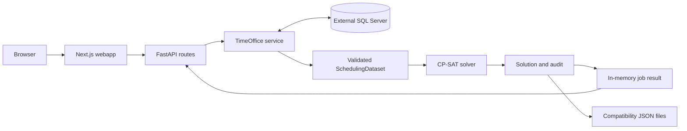

# Codebase overview

The repository contains a Python API, a Next.js webapp and one MkDocs documentation project. FastAPI owns the canonical scheduling domain and solver; TimeOffice-specific SQL, identifiers and translations stay in its adapter. The webapp's imported application/entity/infrastructure layers still contain compatibility code.

## Repository map

```text
.
├── compose.yaml              # API/webapp development startup and mounts
├── .env                      # non-secret database connection settings
├── .secrets/                 # ignored local password file
├── Justfile                  # shared install/check/docs/Compose recipes
├── api/
│   ├── app/
│   │   ├── main.py           # FastAPI construction and runtime lifespan
│   │   ├── settings.py       # environment and secret loading
│   │   ├── dependencies.py   # access to process-local services/jobs/lock
│   │   ├── routers/          # HTTP DTOs, solve jobs and web compatibility
│   │   ├── domain/           # canonical Pydantic scheduling models
│   │   ├── validation/       # dataset integrity checks
│   │   ├── solver/           # CP-SAT building, execution and audit
│   │   └── timeoffice/       # database reads, mappings and writes
│   ├── tests/
│   ├── pyproject.toml
│   ├── uv.lock
│   └── .python-version
├── webapp/
│   ├── src/
│   │   ├── app/              # Next App Router pages and handlers
│   │   ├── features/         # planning screens/components/hooks
│   │   ├── components/       # shared UI primitives
│   │   ├── application/      # imported use cases and ports
│   │   ├── entities/         # imported UI models and errors
│   │   ├── controllers/      # server-action entry points
│   │   ├── infrastructure/   # repositories and compatibility persistence
│   │   ├── di/               # existing container/modules
│   │   └── lib/              # API/configuration and shared helpers
│   ├── package.json
│   ├── pnpm-lock.yaml
│   └── pnpm-workspace.yaml   # single-package settings/build approvals
├── docs/
│   ├── source/               # documentation content
│   ├── mkdocs.yml
│   ├── pyproject.toml
│   └── uv.lock
└── data/                     # persistent runtime files; empty on checkout
```

Service Dockerfiles live alongside their manifests. Generated environments, dependencies, `docs/site/`, webapp build output, secrets and runtime data are ignored. There is no root Node workspace or Python package.

## Request and solve flow



Next.js server-side callers use `SOLVER_API_URL`; Compose sets it to `http://api:8000`. Browser traffic enters the webapp. `api/app/main.py` builds the SQLAlchemy engine, TimeOffice service, solver service, in-memory job store and one solve lock. Shutdown disposes the engine.

`POST /solve/` accepts a month and units, reserves the lock and starts a background task. Database fetching, dataset validation, solver work and compatibility export run through a worker thread. Polling returns job execution state and the eventual solution. Database publication is separate from generation. The [API reference](../reference/api.md) describes the precise route boundaries.

## Where to make a change

| Change                                  | Start here                                                                          |
| --------------------------------------- | ----------------------------------------------------------------------------------- |
| API request/response or job lifecycle   | `api/app/routers/`, `dependencies.py`, `main.py`                                    |
| Scheduling concept or dataset integrity | `api/app/domain/`, `api/app/validation/`                                            |
| Constraint/objective or solving         | `api/app/solver/cp_sat/`, `solver/config.py`, `solver/service.py`                   |
| TimeOffice query, mapping or write      | `api/app/timeoffice/reading/`, `mapping/`, `writing/`, `service.py`                 |
| Screen behavior                         | `webapp/src/app/`, its `features/` directory and actual use-case/repository callers |
| API base URL or runtime file paths      | `webapp/src/lib/config/app-config.ts`                                               |
| Runtime/dependency pins                 | service manifests/locks, Dockerfiles and consuming workflow/tool settings           |
| Documentation                           | `docs/source/` and `docs/mkdocs.yml`                                                |

Trace the real callers before changing a boundary. Keep TimeOffice terminology inside the adapter and use the canonical backend models for new behavior. Read [domain](../reference/domain.md), [solver](../reference/solver.md), [TimeOffice](../reference/timeoffice.md) and [quality](quality.md) for details. The [limitations](../limitations.md) page records remaining compatibility work.
